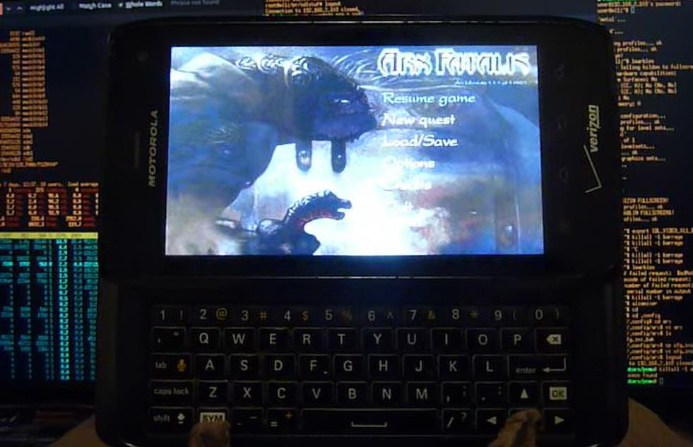
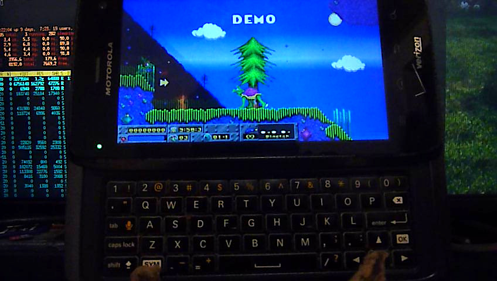

Getting SDL to play nice on Droid 4

                         Simple DirectMedia Layer

                                  (SDL)

                                Version 1.2
			for Maemo-Leste / Droid4
---
http://www.libsdl.org/

This is the Simple DirectMedia Layer, a general API that provides low
level access to audio, keyboard, mouse, joystick, 3D hardware via OpenGL,
and 2D framebuffer across multiple platforms.

The current version supports Linux, Windows CE/95/98/ME/XP/Vista, BeOS,
MacOS Classic, Mac OS X, FreeBSD, NetBSD, OpenBSD, BSD/OS, Solaris, IRIX,
and QNX.  The code contains support for Dreamcast, Atari, AIX, OSF/Tru64,
RISC OS, SymbianOS, Nintendo DS, and OS/2, but these are not officially
supported.

SDL is written in C, but works with C++ natively, and has bindings to
several other languages, including Ada, C#, Eiffel, Erlang, Euphoria,
Guile, Haskell, Java, Lisp, Lua, ML, Objective C, Pascal, Perl, PHP,
Pike, Pliant, Python, Ruby, and Smalltalk.

This library is distributed under GNU LGPL version 2, which can be
found in the file  "COPYING".  This license allows you to use SDL
freely in commercial programs as long as you link with the dynamic
library.

The best way to learn how to use SDL is to check out the header files in
the "include" subdirectory and the programs in the "test" subdirectory.
The header files and test programs are well commented and always up to date.
More documentation is available in HTML format in "docs/index.html", and
a documentation wiki is available online at:
	http://www.libsdl.org/cgi/docwiki.cgi

The test programs in the "test" subdirectory are in the public domain.

Frequently asked questions are answered online:
	http://www.libsdl.org/faq.php

If you need help with the library, or just want to discuss SDL related
issues, you can join the developers mailing list:
	http://www.libsdl.org/mailing-list.php

Enjoy!
	Sam Lantinga				(slouken@libsdl.org)

